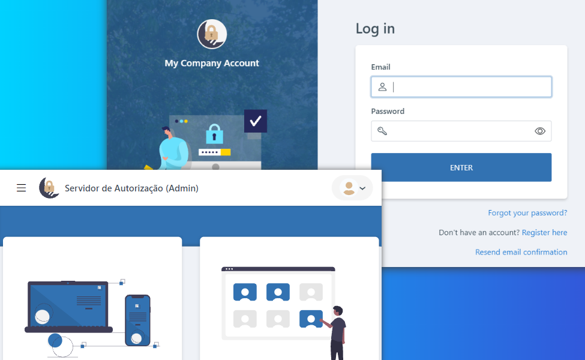

<div align="center">
  
  <h1 align="center">Nocturne Auth Server</h1>
  <p align="center">
    An Open ID and OAuth Authorization Server and Administration Server using
    <a class="https://github.com/openiddict/openiddict-core">OpenIddict</a>.
  </p>
</div>

<div align="center">
  
</div>

<br>

## :book: Purpose
This project was created primarily for educational purposes only — the author wanted to understand better how the Open Id/OAuth workflow works ;).

Therefore, as of now, this project is far from production ready.

## :bulb: Looking for alternatives?
This project was inpired by many cool projects and companies. You may have a look to find which one suits you better:
- [Auth0](https://auth0.com).
- [Keycloak](https://www.keycloak.org).
- [DuendeSoftware IdentityServer](https://duendesoftware.com/products/identityserver) and [Skoruba.Duende.IdentityServer.Admin](https://github.com/skoruba/Duende.IdentityServer.Admin).
- [IdentityServer4](https://identityserver4.readthedocs.io) and [Skoruba.IdentityServer4.Admin](https://github.com/skoruba/IdentityServer4.Admin).
- [Okta](https://www.okta.com).
- [Orchard Core](https://orchardcore.net) _(has a built-in auth provider)_.


## :sparkles: Features
- Complete OpenId and OAuth2 authorization powered by [OpenIddict](https://github.com/openiddict/openiddict-core).
- User account dashboard for self-management (e.g. change password, add two-factor authentication). With email support.
- Create and manage applications (clients).
- Create and manage roles (permissions).
- Manage users.
- Multiple database providers support _(limited to relational databases for now)_.
- Localization.


## :rocket: Quick start
- First make sure you have [docker and docker compose](https://www.docker.com/get-started).
- _Optionally, change the initial settings as needed (read the [Initialization settings section](#scroll-initialization-settings))_
- Run `docker compose up -d` in the repository root.

And that is it :slightly_smiling_face:. After the initialization is completed, the systems will be available in the following urls:
- Admin: [https://localhost:6000](https://localhost:6000).
- OpenId Server: [https://localhost:6001](https://localhost:6001).

If it was not modified in the initialization settings, the default (admin) user is:
- Email: `test@test.com`.
- Password: `Pass123$`.


## :scroll: Initialization settings
When the Admin Server starts it runs an initialization service to check for all required initial setup to make the Server operational.

Some of the settings can be changed if needed by modifing the `src/Admin/initialize.json` file or by using environment variables.

| Setting   | Description
| :-------- | :---------
| `AdminApplication.ClientId` | By convention, this is usually a base62 string of 16 bytes (but can be any string). When modifing it, remember to also change the `Authorization.ClientId` in `appsettings.json`.
| `AdminApplication.ClientId` | By convention, this is usually a base62 string of 16 bytes (but can be any string). When modifing it, remember to also change the `Authorization.ClientId` in `appsettings.json`.
| `AdminApplication.ClientSecret` | By convention, this is usually a base62 string of 32 bytes (but can be any string). When modifing it, remember to also change the `Authorization.ClientSecret` in `appsettings.json`.
| `AdminApplication.PostLogoutRedirectUris` | The URLs to which the OpenId Server will allow to redirect after successful logout.
| `AdminApplication.RedirectUris` | The URLs to which the OpenId Server will allow to redirect after successful login.
| `AdminUser.Name` | The name of the default admin user.
| `AdminUser.Email` | The email of the default admin user.
| `AdminUser.Password` | The password of the default admin user.


## :gear: Local setup
There are different options to build and run the project locally on a development machine. Check the following sections for alternatives.

### Using the host system
If will be installing everything in your development machine:
- Make sure you have at least the minimum [.NET version]((https://dotnet.microsoft.com/download)) set in the [global.json](./global.json).
- Make sure you have [docker and docker compose](https://www.docker.com/get-started/).
- Make sure you have [Node LTS greater or equal than 16](https://nodejs.org/en/).

### Using VSCode Dev Container
If you want to quick setup a development environment, there is a dev container available for VSCode. For more details on how to install and open a dev container, [read the introductory tutorial](https://code.visualstudio.com/docs/devcontainers/tutorial).


## :computer: Development guides
Some guides for development.

### Fast customization
For quick configuration (like name), the following options are available:

```json
"Application": {
  "ApplicationName": "<custom application name>",
  "CompanyName": "<custom company name>",
  "PrivacyPolicyUrl": "<custom privacy policy url>",
  // (Server only) Image to show in login page
  "LoginBackground": {
    "ImageUrl": "<image url>",
    "ImageAttribution": "<image attribution>" // Supports HTML
  }
}
```

### Email configuration
To configure email, there are the following options:

```json
"Email": {
  "SenderName": "<sender name>",
  "SenderEmail": "<sender email>",
  "Host": "<email provider host>",
  "Port": 465, // email provider port
  "UseSSL": true,
  "Security": "Auto",
  "RequiresAuthentication": true,
  "Template": {
    "ApplicationName": "<custom application name>",
    "CompanyInfo": "<custom company info>",
    "CompanyLogoUrl": "<custom company logo url>",
    "CompanyName": "<custom company name>"
  }
}
```

### Configure localization
To configure localization, specify a locale in the following options:

```json
"Localization": {
  "DefaultCulture": "pt-br"
}
```

There must be a localization file available. To add a new one, see [Add a new localization language](#add-a-new-localization-language).

### Configure database
You can configure the database by specifing a database connection name and providing the following options:

```json
"DatabaseConnections": {
  "<ConnectionName>": {
    "Provider": "<one of the valid database providers>",
    "Host": "<host>",
    "Port": "<port>", // Some database providers do not support it. If not specified, it is infered from host
    "Database": "<database name>",
    "User": "<user>",
    "Password": "<password>"
  }
}
```

It is also needed to include/change a database option in `src/Configuration/Options/DatabaseConnections` and to modify the `src/Configuration/Services/DbContextServices` class.

To add a new database provider, see [Add a new database provider](#add-a-new-database-provider).

### Add a new database provider
You can easily add a new database provider by following these steps:
- Create a new project under `src` (use the name `Infra.<ProviderName>` for convention).
- Add a [supported EntityFrameworkCore provider](https://learn.microsoft.com/en-us/ef/core/providers) package.
- Add a class that implements `IEntityFrameworkDatabaseProvider` (you can check the other projects for reference). It is also recommended that the migrations assembly is set to the current provider project.
- Add the new provider to `Providers` in `src/Configuration/Services/DbContextServices`.

### Add a new localization language
The systems' localization uses [PO](https://www.gnu.org/software/gettext/manual/html_node/PO-Files.html) files. To add a new language, seek for a directory `Locales` at the root of the project to be localized, and add a new file following the convention: `<locale>.po`.

Localization is base on the literal text (in English, the default language).

For reference of language tags, see [IETF BCP 47 language tag](https://en.wikipedia.org/wiki/IETF_language_tag).

### Add email template
Email templates uses [Liquid template language](https://shopify.github.io/liquid). There is no convetion for where to add the templates, but it is highly recommended they are added to a directory `Templates/Emails` at the project root.

Currently theres is limited suport for localization. Maybe the templates should also be separated by locales in the future.

### Web assets
Javascripts and css files are bundled in a `dist` directory when building the `web` project.

It is necessary that the `web` project is always built when modified. See the [project README](./web/README.md) for more details.

### Migrations
Migrations are created using the Entity Framework migrations.

Before executing a script, it is needed to change the database connection configuration depending on the provider used. For example, if the migration should be applied to `Infra.SqlServer`, the `src/Admin` database connection option should be configured to use the `SqlServer` provider.

**Example of scripts:**
| Description | Script
| :---------- | :-----
| Add migration | `dotnet ef migrations add <name> -p src/Infra.<provider> -s src/Admin -c <context>`
| Remove last added migration | `dotnet ef migrations remove -p src/Infra.<provider> -s src/Admin -c <context>`

**Contexts reference:**
| Name
| :---
| ApplicationIdentityDbContext
| AuthorizationDbContext
| DataProtectionDbContext

For more information on working with Entity Framework migrations, read [the migrations docs](https://learn.microsoft.com/pt-br/ef/core/managing-schemas/migrations).


## :cop: Authorization guide
The server was designed to only provide Role based authorization control (RBAC) to keep it minimal and simple. Although, as limitation, depending on the amount of roles a user have, the jwt token might be overly sized. Also, roles with the same name would generate conflicts.

The ideia of roles was primarily designed to act as permissions instead of roles itself. So, instead of `Administrator`, use names that convey actions, for example `AdminServer.Applications.Manage`.

As a convention for naming roles (actions), we propose using the format:
```
<systemName>.<scope or feature>.<action>
```

In addition to this, always try to use policy base authorization were possible in the systems (will depend on the language/framework you use).


## :balance_scale: License
This project is licensed under GPL 3.0. _If necessary, the license can be modified._
